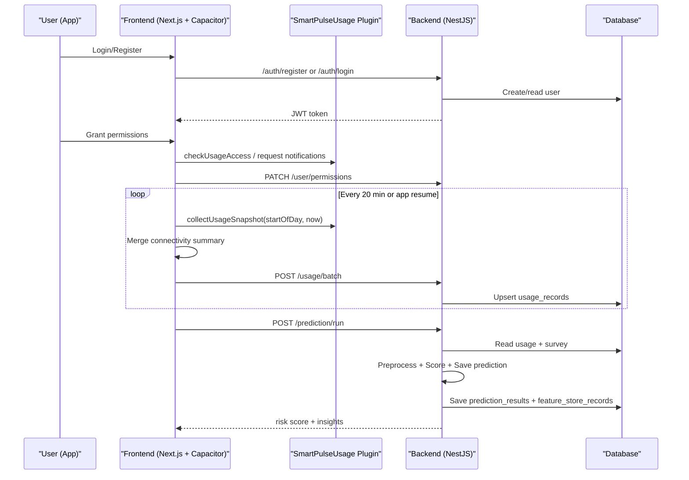

# SmartPulse System Deep Dive (Implementation-Level)

Last updated: 2026-03-17

This document is a detailed, code-referenced explanation of how SmartPulse works end to end, including ML, Capacitor plugins, data collection, telemetry accuracy, and permissions. It is based on the current implementation in:

- Backend: `backend/src/**`
- Frontend: `frontend/src/**`
- Android: `frontend/android/**`
- Existing docs: `docs/smartpulse-modules.md`, `docs/ml-model-training-and-algorithm-internals.md`, `frontend/docs/capacitor-android-integration.md`

## 1. High-Level Architecture

SmartPulse consists of three runtime layers:

1. **Frontend (Next.js)** with optional **Capacitor Android runtime** for native telemetry.
2. **Backend (NestJS)** API with TypeORM entities and ML services.
3. **Database** via `better-sqlite3` + `libsql` driver (Turso-compatible) with schema auto-sync.

Key backend modules are wired in [`backend/src/app.module.ts`](backend/src/app.module.ts) and include:

- `AuthModule`, `UserModule`
- `SurveyModule`, `UsageModule`
- `PreprocessingModule`, `PredictionModule`
- `RiskAnalysisModule`, `RecommendationModule`
- `NotificationModule`, `AnalyticsModule`
- `GroundTruthModule`

Database config is set in `TypeOrmModule.forRootAsync` with:

- `type: 'better-sqlite3'`
- driver override using `libsql` (Turso)
- `database: process.env.DATABASE_NAME` or default `libsql://smartpulse-blazeking.aws-ap-south-1.turso.io`
- `synchronize: true` (schema auto sync)

Reference: [`backend/src/app.module.ts`](backend/src/app.module.ts)

## 2. Runtime Configuration

### Backend
From [`backend/README.md`](backend/README.md) and [`backend/src/main.ts`](backend/src/main.ts):

- `PORT` (default 3001)
- `HOST` (default `0.0.0.0`)
- `CORS_ORIGIN` (comma-separated; includes `capacitor://localhost`)
- `JWT_SECRET`
- TLS: `HTTPS_KEY_PATH`, `HTTPS_CERT_PATH`
- Groq LLM: `GROQ_API_KEY`, `GROQ_MODEL`, `GROQ_TIMEOUT_MS`

`main.ts` enables:

- CORS for the configured origins
- `ValidationPipe` with `whitelist: true`, `forbidNonWhitelisted: true`
- Global prefix `api`

### Frontend
From [`frontend/README.md`](frontend/README.md) and [`frontend/src/lib/api.ts`](frontend/src/lib/api.ts):

- `NEXT_PUBLIC_API_URL` (default `http://localhost:3001/api`)
- `NEXT_PUBLIC_API_URL_MOBILE` for Capacitor runtime

The API client uses `CapacitorHttp` when running in native-like runtimes to avoid CORS and mixed-content issues.

## 3. Authentication and Session Flow

### Backend
Auth is JWT-based:

- Register/login using `AuthService` with bcrypt password hashing.
- JWT payload: `{ sub, email, role }`.
- JWT guard protects all non-auth endpoints.

Reference:

- [`backend/src/auth/auth.service.ts`](backend/src/auth/auth.service.ts)
- [`backend/src/auth/jwt.strategy.ts`](backend/src/auth/jwt.strategy.ts)
- [`backend/src/auth/jwt-auth.guard.ts`](backend/src/auth/jwt-auth.guard.ts)

### Frontend
Token is stored in `localStorage`:

- `api.setToken()` on login/register
- `api.getToken()` attaches `Authorization: Bearer <token>`

Reference: [`frontend/src/lib/api.ts`](frontend/src/lib/api.ts)

## 4. Permissions System (Backend + Frontend + Native)

### Backend data model
Permissions are stored per user in `permissions` table.

Entity fields:

- `screenUsageMonitoring`
- `appUsageStatistics`
- `notificationAccess`
- `backgroundActivityTracking`
- `locationTracking`

Reference: [`backend/src/entities/permission.entity.ts`](backend/src/entities/permission.entity.ts)

### Backend API
Endpoints:

- `GET /api/user/permissions`
- `PATCH /api/user/permissions`

Reference:

- [`backend/src/user/user.controller.ts`](backend/src/user/user.controller.ts)
- [`backend/src/user/user.service.ts`](backend/src/user/user.service.ts)

Behavior:

- On read, if no permission row exists, it creates a default row.
- On update, it saves fields and sets `users.permissionsConfigured = true`.

### Frontend behavior
The permissions UI merges three sources:

1. Server permissions
2. Local cached permissions (localStorage)
3. Native permission state (Usage Access + Notifications) when on Android

Flow:

1. Load server permissions.
2. Merge with cached local state.
3. If on native, call `hasUsageAccess()` and auto-enable `screenUsageMonitoring`, `appUsageStatistics`, and `backgroundActivityTracking` if granted.
4. If on native, call `checkPushPermission()` and auto-enable `notificationAccess` if granted.
5. If the resolved state has more enabled permissions than the server, update the server state.

Reference:

- [`frontend/src/app/dashboard/permissions/page.tsx`](frontend/src/app/dashboard/permissions/page.tsx)
- [`frontend/src/lib/mobile/permissionState.ts`](frontend/src/lib/mobile/permissionState.ts)
- [`frontend/src/lib/mobile/permissions.ts`](frontend/src/lib/mobile/permissions.ts)

### Native permission requests
`ensureNativePermission(field)` routes to:

- Usage Access settings for screen/app/background.
- Local notification permission prompt.
- Geolocation permission (request/check).

Reference: [`frontend/src/lib/mobile/permissions.ts`](frontend/src/lib/mobile/permissions.ts)

### Native setup checklist
`NativeSetupChecklist` shows:

- Usage Access status
- Notification permission
- Battery optimization exemption (recommended)

Reference: [`frontend/src/components/NativeSetupChecklist.tsx`](frontend/src/components/NativeSetupChecklist.tsx)

### Behavior sync state (interventions + action tracking)
SmartPulse stores user-level behavior tracking data in `users.behaviorSyncJson`.

API endpoints:

- `GET /api/user/behavior-sync`
- `PATCH /api/user/behavior-sync`

Payload shape (sanitized on write):

- `actionTracker`: map of action id to boolean
- `completedDates`: array of `YYYY-MM-DD` (deduped, max 180)
- `activeIntervention`: `{ id, startedAt, endsAt }` or null

Reference:

- [`backend/src/user/user.service.ts`](backend/src/user/user.service.ts)
- [`backend/src/user/user.controller.ts`](backend/src/user/user.controller.ts)

## 5. Capacitor Runtime and Plugins

### Core architecture
Capacitor provides a JS bridge to native plugins. The helper layer in the frontend abstracts plugin access:

- `isNativePlatform()` and `getPlatform()`
- `hasPluginMethod()`
- `invokePlugin()`

Reference: [`frontend/src/lib/mobile/capacitorBridge.ts`](frontend/src/lib/mobile/capacitorBridge.ts)

### Capacitor configuration
From [`frontend/capacitor.config.json`](frontend/capacitor.config.json):

- `appId`: `io.smartpulse.app`
- `appName`: `SmartPulse`
- `webDir`: `out` (Next.js export output)
- `bundledWebRuntime`: false
- `android.allowMixedContent`: true
- `SplashScreen.launchShowDuration`: 0

### Built-in plugins used
The code relies on:

- `Device` (device metadata)
- `App` (foreground/background)
- `Network` (connectivity status + events)
- `Preferences` (storage)
- `LocalNotifications` (alerts)
- `Geolocation` (permission request only)

References:

- [`frontend/src/lib/mobile/device.ts`](frontend/src/lib/mobile/device.ts)
- [`frontend/src/lib/mobile/appState.ts`](frontend/src/lib/mobile/appState.ts)
- [`frontend/src/lib/mobile/network.ts`](frontend/src/lib/mobile/network.ts)
- [`frontend/src/lib/mobile/preferences.ts`](frontend/src/lib/mobile/preferences.ts)
- [`frontend/src/lib/mobile/pushNotifications.ts`](frontend/src/lib/mobile/pushNotifications.ts)
- [`frontend/src/lib/mobile/permissions.ts`](frontend/src/lib/mobile/permissions.ts)

### Capacitor HTTP vs browser fetch
The API client switches transport based on runtime:

- Native or Capacitor-localhost runtime: uses `CapacitorHttp.request()` to avoid CORS and mixed-content issues.
- Web runtime: uses `fetch()`.

Runtime detection considers:

- `Capacitor.isNativePlatform()` for native builds.
- Special case for `https://localhost` with Capacitor platform set (treated as native-like).

Reference: [`frontend/src/lib/api.ts`](frontend/src/lib/api.ts)

### Custom plugin: `SmartPulseUsage`
The Android plugin is registered in:

- [`frontend/android/app/src/main/java/io/smartpulse/app/MainActivity.java`](frontend/android/app/src/main/java/io/smartpulse/app/MainActivity.java)

It exposes methods:

- `checkUsageAccess`
- `openUsageAccessSettings`
- `checkBatteryOptimization`
- `openBatteryOptimizationSettings`
- `collectUsageSnapshot`

Reference: [`frontend/android/app/src/main/java/io/smartpulse/app/SmartPulseUsagePlugin.java`](frontend/android/app/src/main/java/io/smartpulse/app/SmartPulseUsagePlugin.java)

Implementation details:

- Usage access check: `AppOpsManager.OPSTR_GET_USAGE_STATS` and `MODE_ALLOWED`.
- Battery optimization: `PowerManager.isIgnoringBatteryOptimizations(packageName)`.

### Android permissions
Defined in `AndroidManifest.xml`:

- `PACKAGE_USAGE_STATS` (Usage Access)
- `POST_NOTIFICATIONS`
- `ACCESS_NETWORK_STATE`
- `FOREGROUND_SERVICE`
- Optional: `ACTIVITY_RECOGNITION`, `REQUEST_IGNORE_BATTERY_OPTIMIZATIONS`, `ACCESS_COARSE_LOCATION`, `ACCESS_FINE_LOCATION`

Reference: [`frontend/android/app/src/main/AndroidManifest.xml`](frontend/android/app/src/main/AndroidManifest.xml)

## 6. Data Collection Pipeline (Device to Backend)

### 6.1 Survey data (self-reported)
Survey data is collected via `/api/survey` and stored in `survey_responses`. The survey includes:

- stress, anxiety, depression (1-10)
- sleep quality (1-10), sleep hours
- social interaction (1-10)
- daily productivity (1-10)
- phone dependence (1-10)
- mood (1-5)
- optional notes

Reference:

- [`backend/src/survey/survey.service.ts`](backend/src/survey/survey.service.ts)
- [`backend/src/entities/survey-response.entity.ts`](backend/src/entities/survey-response.entity.ts)

### 6.2 Usage telemetry (Android)
Usage telemetry is collected only in native (Capacitor Android) builds with Usage Access granted.

Entry point (frontend):

- `useUsageSync()` runs in the dashboard layout when a user is logged in.
- It triggers `runUsageSyncCycle()` at:
  - startup
  - every `USAGE_SYNC_INTERVAL_MS` (20 minutes)
  - when the app returns to foreground

Reference:

- [`frontend/src/hooks/useUsageSync.ts`](frontend/src/hooks/useUsageSync.ts)
- [`frontend/src/components/DashboardLayout.tsx`](frontend/src/components/DashboardLayout.tsx)
- [`frontend/src/lib/mobile/usageSync.ts`](frontend/src/lib/mobile/usageSync.ts)

#### Snapshot window
Each cycle builds a snapshot from **start-of-day to now**.

```ts
const today = new Date();
const start = startOfDay(today);
collectUsageSnapshot(start.getTime(), today.getTime());
```

This means each sync sends a daily aggregate for the current date.

### 6.3 Local buffering and upload
Usage records are buffered on-device using Capacitor `Preferences`:

- Buffer key: `usage_buffer_v1`
- Records are deduped by date.
- Records are uploaded via `/api/usage/batch`.

If upload succeeds:

- Buffer is cleared.
- `usage_last_sync_iso` is updated.

Network status is checked before upload. If offline, it defers.

Reference: [`frontend/src/lib/mobile/usageSync.ts`](frontend/src/lib/mobile/usageSync.ts)

### 6.4 Network trace telemetry
The frontend tracks connectivity changes to compute offline/online duration metrics.

Mechanism:

- `recordNetworkTraceSample()` is called:
  - on each sync cycle
  - on network status change
- A trace is persisted under `usage_network_trace_v1`.
- Trace is trimmed to 14 days and max 1600 entries.

At snapshot time, the trace is summarized to:

- `transitionCount`
- `connectedMinutes`, `offlineMinutes`
- `wifiMinutes`, `cellularMinutes`, `unknownMinutes`
- `longestOfflineStreakMinutes`
- `currentConnectionType`

This summary is merged into `connectivityContextJson`.

Reference: [`frontend/src/lib/mobile/usageSync.ts`](frontend/src/lib/mobile/usageSync.ts)

## 7. Telemetry Fields and How They Are Derived

Below is the actual implementation logic for each field in `UsageUploadRecord`.

### Core usage metrics

Field | Source | Implementation
---|---|---
`screenTimeMinutes` | UsageStats + ScreenStateReceiver | Aggregated app foreground durations from `UsageEvents`. If `ScreenStateReceiver` has `totalScreenTimeMs`, it overrides the total.
`appUsageJson` | UsageStats | Map of `appLabel -> minutes` (not package name).
`socialMediaMinutes` | Heuristic | App label + package keyword matching (`SOCIAL_KEYWORDS`) in the plugin.
`nightUsageMinutes` | UsageEvents | Sum of usage minutes during night hours (22:00-06:00) from hourly buckets.
`peakUsageHour` | UsageEvents | Hour (0-23) with maximum usage minutes from hourly buckets.
`longestSessionMinutes` | UsageEvents + ScreenStateReceiver | Max session duration from app resume/pause/stop, also compared with last screen-on session.
`unlockCount` | UsageEvents | Count of `KEYGUARD_HIDDEN` events (unlock events).
`notificationCount` | UsageEvents | Counts `NOTIFICATION_INTERRUPTION` events (event type 12).

Reference: [`frontend/android/app/src/main/java/io/smartpulse/app/SmartPulseUsagePlugin.java`](frontend/android/app/src/main/java/io/smartpulse/app/SmartPulseUsagePlugin.java)

Night hours are defined as 22:00-06:00 in local device time.

### 7.1 App categorization and timeline logic

Categorization is purely keyword-based, using `(packageName + appLabel).toLowerCase()` and the following sets:

- social: instagram, facebook, whatsapp, messenger, telegram, snapchat, twitter, linkedin, reddit, discord, youtube, tiktok
- video: youtube, netflix, primevideo, hotstar, hulu, mxplayer, vimeo, video, ott
- games: game, pubg, freefire, cod, clash, roblox, minecraft, candy
- productivity: docs, sheets, slides, notion, calendar, outlook, gmail, slack, teams, zoom, meet, office, todo, task, drive
- other: everything else

The category timeline is a 15-minute bucket map. Each app session is split into quarter-hour segments, and the minutes are accumulated into the bucket corresponding to the segment start (for example `13:30`).

### 7.2 ScreenStateReceiver and screen-on time

`ScreenStateReceiver` listens to `ACTION_SCREEN_ON` and `ACTION_SCREEN_OFF` to accumulate screen-on time:

- `lastScreenOn` timestamp is stored when the screen turns on.
- On screen off, duration is added to `totalScreenTimeMs`.
- `lastSessionDurationMs` is stored for the most recent session.

`SmartPulseUsagePlugin` uses `totalScreenTimeMs` (if present) to override the UsageStats-derived total.

Reference: [`frontend/android/app/src/main/java/io/smartpulse/app/ScreenStateReceiver.java`](frontend/android/app/src/main/java/io/smartpulse/app/ScreenStateReceiver.java)

### 7.3 Step sensor and reaction latency

The plugin registers `Sensor.TYPE_STEP_COUNTER` and stores the latest sensor value under `dailyStepCount` in `SmartPulseScreenPrefs`. This value is added into `activityContext.advancedSensors.stepCount`.

It also computes a basic notification reaction latency:

- When `NOTIFICATION_INTERRUPTION` occurs, it sets `lastNotificationTimeMs`.
- If an `ACTIVITY_RESUMED` happens within 60 seconds, the latency is recorded.
- The average latency is stored as `activityContext.advancedSensors.avgLatencySec`.

Additionally, it records a `habitSequence` list of up to 50 recently resumed app package names.

Short sessions are counted when a session duration is <= 2 minutes. Sessions during commute hours (07:00-09:00 or 17:00-20:00) increment a separate `commuteShortSessionCount`, which feeds the heuristic activity context.

### Category timeline and session stream

Field | Source | Implementation
---|---|---
`appCategoryTimelineJson` | UsageEvents | 15-minute buckets with category minutes (social/video/games/productivity/other).

### Context telemetry

Field | Source | Implementation
---|---|---
`activityContextJson` | Heuristic | Based on total screen time + short sessions. Adds `advancedSensors` with step count and notification reaction latency.
`connectivityContextJson` | Network trace summary | Merged in JS from `summarizeConnectivityContext`.
`locationContextJson` | Heuristic | Based on usage time-of-day windows (home/work/commute/other), not GPS.

Reference:

- Plugin: [`frontend/android/app/src/main/java/io/smartpulse/app/SmartPulseUsagePlugin.java`](frontend/android/app/src/main/java/io/smartpulse/app/SmartPulseUsagePlugin.java)
- JS merge: [`frontend/src/lib/mobile/usageSync.ts`](frontend/src/lib/mobile/usageSync.ts)

### Micro check-ins and interventions

Two additional usage-related streams are appended on the server:

- `microCheckinsJson` via `POST /api/usage/micro-checkin`
- `interventionOutcomesJson` via `POST /api/usage/intervention-event`

Reference: [`backend/src/usage/usage.service.ts`](backend/src/usage/usage.service.ts)

## 8. Telemetry Accuracy and Known Limitations

This section is critical for understanding accuracy and reliability.

### UsageStats-based signals
The Android plugin relies on `UsageStatsManager` and `UsageEvents`. This provides system-reported app foreground activity, but:

- It is only available after Usage Access permission is granted.
- Coverage and event granularity depend on OS and OEM behavior.
- If events are missing, usage will be undercounted.

### Screen time
`screenTimeMinutes` is computed from app foreground sessions and optionally overridden by `ScreenStateReceiver` totals. This has tradeoffs:

- Screen on/off time can over-count "active" use (screen on but idle).
- UsageEvents can under-count if events are missing.

### Unlock count
Unlock count is computed from `UsageEvents.Event.KEYGUARD_HIDDEN` events. Accuracy depends on OS event reporting and may under-count on devices that suppress keyguard events.

### Night usage, peak hour, longest session
These are computed from UsageEvents-derived hourly buckets and session durations. If UsageEvents are missing, night usage and peak hour can be undercounted, and longest session can be underestimated.

### Notification metrics
`notificationCount` increments on `NOTIFICATION_INTERRUPTION` events. This may under-count depending on device behavior.
Notification open latency is computed but stored only inside `activityContext.advancedSensors.avgLatencySec`.

### Step count
The step sensor uses `TYPE_STEP_COUNTER`, which is typically cumulative since device boot. The plugin stores the raw value as `dailyStepCount` without resetting, so it is not a true daily step total.

### Connectivity context
Connectivity is estimated from periodic samples and network-change events. It is not a continuous network logger.

### Location context
Location context is **not GPS-based**. It is inferred from usage timestamps:

- `homeMinutes`: usage in 22:00-06:00
- `workMinutes`: 09:00-17:00
- `commuteMinutes`: 07:00-09:00 and 17:00-20:00

Even if `locationTracking` permission is granted, the current snapshot does not include GPS-derived coordinates.

### Battery context
Battery telemetry methods exist in Java but are not wired into the snapshot. It is currently empty.

### Background collection
`UsageSyncWorker` runs a native background sync every 6 hours (network required). It collects a snapshot and uploads directly to the backend using the stored token and API base saved in Capacitor Preferences. In-app sync still runs every 20 minutes and on app resume.

## 9. Backend Data Storage Model

All tables are defined as TypeORM entities.

### Core user tables

- `users` ([`backend/src/entities/user.entity.ts`](backend/src/entities/user.entity.ts))
- `permissions` ([`backend/src/entities/permission.entity.ts`](backend/src/entities/permission.entity.ts))

### Data tables

- `survey_responses`
- `usage_records`
- `feature_store_records`
- `prediction_results`
- `model_profiles`
- `ground_truth_labels`
- `notification_history`

References:

- [`backend/src/entities/survey-response.entity.ts`](backend/src/entities/survey-response.entity.ts)
- [`backend/src/entities/usage-record.entity.ts`](backend/src/entities/usage-record.entity.ts)
- [`backend/src/entities/feature-store-record.entity.ts`](backend/src/entities/feature-store-record.entity.ts)
- [`backend/src/entities/prediction-result.entity.ts`](backend/src/entities/prediction-result.entity.ts)
- [`backend/src/entities/model-profile.entity.ts`](backend/src/entities/model-profile.entity.ts)
- [`backend/src/entities/ground-truth-label.entity.ts`](backend/src/entities/ground-truth-label.entity.ts)
- [`backend/src/entities/notification-history.entity.ts`](backend/src/entities/notification-history.entity.ts)

### Usage record upsert semantics
`UsageService.createOrUpdateRecord()` uses `(userId, date)` and updates if a record already exists.

Implication: multiple syncs for the same date overwrite earlier data for that date.

Reference: [`backend/src/usage/usage.service.ts`](backend/src/usage/usage.service.ts)

## 10. Preprocessing (Feature Engineering)

Implemented in [`backend/src/preprocessing/preprocessing.service.ts`](backend/src/preprocessing/preprocessing.service.ts).

### 10.1 Data window and dedupe

1. Load latest survey plus the last `lookbackDays` usage records (default 30, clamped 7..180).
2. Deduplicate usage records by `date` (keep the newest `createdAt`).

### 10.2 Usage validation and cleaning

Any usage record failing validation is dropped.

Validation rules:

Field | Min | Max | Notes
---|---|---|---
`screenTimeMinutes` | 0 | 1440 | total daily screen time
`unlockCount` | 0 | 2000 | unlocks per day
`socialMediaMinutes` | 0 | 1440 | social usage minutes
`nightUsageMinutes` | 0 | 720 | night window usage
`longestSessionMinutes` | 0 | 720 | longest continuous session
`notificationCount` | 0 | 2000 | notifications per day

Relational checks:

- `socialMediaMinutes <= screenTimeMinutes`
- `nightUsageMinutes <= screenTimeMinutes`
- `longestSessionMinutes <= screenTimeMinutes`

### 10.3 Survey validation and fallback

All survey fields must be finite numbers. If any are missing or invalid, the survey is dropped and neutral defaults are used:

- `stressLevel = 5`
- `anxietyLevel = 5`
- `depressionLevel = 5`
- `sleepQuality = 5`
- `sleepHours = 7`
- `socialInteraction = 5`
- `dailyProductivity = 5`
- `phoneDependence = 5`
- `mood = 3`

### 10.4 Context extraction from telemetry JSON

Parsed JSON inputs:

- `notificationInteractionJson`
- `sleepProxyJson`
- `connectivityContextJson`
- `activityContextJson`
- `locationContextJson`

Derived contextual signals and defaults:

Signal | Source field | Default | Bounds
---|---|---|---
`notificationResponseRate` | sum(opened)/sum(posted) | 0 | 0..100
`sleepRegularityScore` | `sleepProxy.sleepRegularityScore` | 70 | 0..100
`wakeAfterSleepChecks` | `sleepProxy.wakeAfterSleepChecks` | 0 | 0..200
`midnightSessionCount` | `sleepProxy.midnightSessionCount` | 0 | 0..200
`connectivityTransitionCount` | `connectivityContext.transitionCount` | 0 | 0..1000
`offlineMinutes` | `connectivityContext.offlineMinutes` | 0 | 0..1440
`longestOfflineStreakMinutes` | `connectivityContext.longestOfflineStreakMinutes` | 0 | 0..1440
`shortSessionCount` | `activityContext.shortSessionCount` | 0 | 0..500
`commuteMinutes` | `locationContext.commuteMinutes` | 0 | 0..1440

### 10.5 Usage averages

All usage features are averaged across the cleaned records. If no records remain, averages are 0 except:

- `avgSleepRegularityScore = 70`

### 10.6 Normalization rules

```
screenTimeNorm = normalize(avgScreenTimeMinutes, 0, 720)
unlockNorm = normalize(avgUnlockCount, 0, 180)
socialNorm = normalize(avgSocialMediaMinutes, 0, 360)
nightNorm = normalize(avgNightUsageMinutes, 0, 180)
sessionNorm = normalize(avgLongestSessionMinutes, 0, 120)
notificationNorm = normalize(avgNotificationCount, 0, 300)

notificationResponseNorm = clamp(avgNotificationResponseRate / 100, 0, 1)
sleepRegularityRiskNorm = clamp((100 - avgSleepRegularityScore) / 100, 0, 1)
connectivityDisruptionNorm =
  clamp(normalize(avgOfflineMinutes, 0, 480) * 0.6 +
        normalize(avgConnectivityTransitions, 0, 40) * 0.4, 0, 1)
activityFragmentationNorm = clamp(normalize(avgShortSessionCount, 0, 80), 0, 1)
commuteImpulseNorm = clamp(normalize(avgCommuteMinutes, 0, 240), 0, 1)

stressNorm = clamp((stressLevel + anxietyLevel + depressionLevel) / 30, 0, 1)
dependenceNorm = normalize(phoneDependence, 1, 10)

activeHoursEstimate = clamp((avgScreenTimeMinutes / 60) * 1.6 + 3.2, 4, 18)
compulsiveCheckingNorm = normalize(avgUnlockCount / activeHoursEstimate, 0, 18)
socialIntensityNorm = clamp(avgSocialMediaMinutes / max(avgScreenTimeMinutes, 1), 0, 1)
nightRatioNorm = clamp(avgNightUsageMinutes / max(avgScreenTimeMinutes, 1), 0, 1)

sleepHourPenalty = if sleepHours < 7
  normalize(7 - sleepHours, 0, 4)
else
  normalize(sleepHours - 9, 0, 4) * 0.4
sleepQualityPenalty = normalize(10 - sleepQuality, 0, 9)
sleepDisruptionNorm = clamp(sleepHourPenalty * 0.6 + sleepQualityPenalty * 0.4, 0, 1)
```

### 10.7 Engineered feature formulas

```
lateNightUsageScore =
  (nightNorm * 0.7 + nightRatioNorm * 0.3) * 100

socialMediaDependencyScore =
  (socialNorm * 0.55 + socialIntensityNorm * 0.25 + dependenceNorm * 0.2) * 100

notificationLoadScore =
  (notificationNorm * 0.7 + notificationResponseNorm * 0.3) * 100

sleepRegularityRiskScore = sleepRegularityRiskNorm * 100
connectivityDisruptionScore = connectivityDisruptionNorm * 100
activityFragmentationScore = activityFragmentationNorm * 100
commuteImpulseScore = commuteImpulseNorm * 100

moodRiskScore = normalize(5 - mood, 0, 4) * 100
productivityRiskScore = normalize(10 - dailyProductivity, 0, 9) * 100
psychologicalStressScore = stressNorm * 100
sleepDisruptionScore = sleepDisruptionNorm * 100

addictionBehaviorScore =
  (screenTimeNorm * 0.27 +
   unlockNorm * 0.2 +
   compulsiveCheckingNorm * 0.16 +
   socialNorm * 0.17 +
   nightNorm * 0.12 +
   sessionNorm * 0.08) * 100

digitalDependencyScore =
  (screenTimeNorm * 0.24 +
   unlockNorm * 0.2 +
   compulsiveCheckingNorm * 0.2 +
   socialIntensityNorm * 0.16 +
   nightRatioNorm * 0.1 +
   dependenceNorm * 0.1) * 100

overallRiskSignal =
  addictionBehaviorScore * 0.39 +
  digitalDependencyScore * 0.17 +
  socialMediaDependencyScore * 0.12 +
  psychologicalStressScore * 0.12 +
  sleepDisruptionScore * 0.06 +
  notificationLoadScore * 0.04 +
  sleepRegularityRiskScore * 0.04 +
  connectivityDisruptionScore * 0.02 +
  activityFragmentationScore * 0.01 +
  commuteImpulseScore * 0.01 +
  moodRiskScore * 0.01 +
  productivityRiskScore * 0.01
```

### 10.8 Feature selection

Feature selection keeps a feature if any of the following are true:

- It is in the essential feature list.
- Its model importance is >= 0.7.
- Its variance is >= 0.02.

Essential features:

- `avgScreenTimeMinutes`
- `avgUnlockCount`
- `avgSocialMediaMinutes`
- `avgNightUsageMinutes`
- `avgSleepRegularityScore`
- `psychologicalStressScore`
- `sleepDisruptionScore`
- `digitalDependencyScore`
- `compulsiveCheckingScore`
- `overallRiskSignal`

### 10.9 Feature store persistence

If `persist` is enabled (default), the feature vector, normalized values, feature selection, and quality metadata are saved in `feature_store_records`.

## 11. Prediction and ML (Scoring + Training)

Implemented in [`backend/src/prediction/prediction.service.ts`](backend/src/prediction/prediction.service.ts).

### 11.1 Inference pipeline

1. Preprocess user data.
2. Auto-train model if conditions are met.
3. Load ensemble weights (defaults if missing).
4. Load learned scorers (tree ensembles or linear models).
5. Score each channel (`randomForest`, `extraTrees`, `svm`).
6. Combine weighted ensemble -> `riskScore` (0..100).
7. Classify `HIGH >= 70`, `MODERATE >= 40`, else `LOW`.

### 11.2 Deterministic fallback formulas

When learned models are missing, the fallback formulas are used:

```
randomForestScore =
  addictionBehaviorScore * 0.33 +
  digitalDependencyScore * 0.18 +
  socialMediaDependencyScore * 0.16 +
  lateNightUsageScore * 0.10 +
  sleepDisruptionScore * 0.07 +
  notificationLoadScore * 0.06 +
  sleepRegularityRiskScore * 0.06 +
  connectivityDisruptionScore * 0.04

extraTreesScore =
  addictionBehaviorScore * 0.30 +
  compulsiveCheckingScore * 1.6 +
  psychologicalStressScore * 0.17 +
  productivityRiskScore * 0.08 +
  socialMediaIntensity * 0.09 +
  activityFragmentationScore * 0.08 +
  commuteImpulseScore * 0.04 +
  notificationLoadScore * 0.06 +
  bound(((avgScreenTimeMinutes / 720) * (avgUnlockCount / 180) * 100)) * 0.14

svmScore =
  overallRiskSignal * 0.5 +
  digitalDependencyScore * 0.15 +
  psychologicalStressScore * 0.14 +
  sleepDisruptionScore * 0.08 +
  notificationLoadScore * 0.05 +
  sleepRegularityRiskScore * 0.04 +
  connectivityDisruptionScore * 0.04
```

Note: `bound(x)` above is a clamp to `[0, 100]`.

### 11.3 Ensemble combination

Default weights:

- `w_rf = 0.40`
- `w_et = 0.35`
- `w_svm = 0.25`

Risk score:

```
riskScore = randomForestScore * w_rf +
            extraTreesScore * w_et +
            svmScore * w_svm
```

### 11.4 Training data assembly and label precedence

Training samples are merged from:

- `feature_store_records`
- `prediction_results` (if feature store is missing that date)
- `ground_truth_labels` (override)

Label precedence:

1. Ground truth
2. Derived feature label
3. Derived prediction label

### 11.5 Learned model training

Target mapping for regression:

- `LOW -> 20`
- `MODERATE -> 55`
- `HIGH -> 85`

Learned scorers can be tree ensembles or linear regression fallbacks.

Tree ensembles:

- recursive squared-error splits
- BEST or RANDOM split strategies
- feature subsampling
- bootstrap or subsample rows

Channel-specific tree settings:

- randomForest: 29 trees, maxDepth 5, minSamplesLeaf 3, featureSubsampleRatio 0.65, splitCandidatesPerFeature 10, splitStrategy BEST, bootstrap true
- extraTrees: 35 trees, maxDepth 5, minSamplesLeaf 2, featureSubsampleRatio 0.8, splitCandidatesPerFeature 14, splitStrategy RANDOM, bootstrap false
- svm: 21 trees, maxDepth 4, minSamplesLeaf 3, featureSubsampleRatio 0.55, splitCandidatesPerFeature 8, splitStrategy BEST, bootstrap true

Linear fallback model (when tree training is not possible):

- Z-score normalization per feature
- Gradient descent uses 260 iterations, learning rate 0.05, and L2 regularization 0.01.

### 11.6 Feature selection for learned models

Preferred feature sets per channel:

- randomForest: addictionBehaviorScore, digitalDependencyScore, socialMediaDependencyScore, lateNightUsageScore, sleepDisruptionScore, notificationLoadScore, sleepRegularityRiskScore, connectivityDisruptionScore
- extraTrees: addictionBehaviorScore, compulsiveCheckingScore, psychologicalStressScore, activityFragmentationScore, commuteImpulseScore, notificationLoadScore, socialMediaIntensity, avgScreenTimeMinutes, avgUnlockCount
- svm: overallRiskSignal, digitalDependencyScore, psychologicalStressScore, sleepDisruptionScore, notificationLoadScore, sleepRegularityRiskScore, connectivityDisruptionScore

If preferred features are missing, the trainer falls back to stable features with sufficient coverage.

### 11.7 Auto-training thresholds

Auto training runs when:

- samples >= 8
- at least 3 new samples since last training, or learned model missing, or stale by 14 days
- at least 24 hours since last training

Constants:

- `AUTO_TRAIN_MIN_SAMPLES = 8`
- `AUTO_TRAIN_MIN_NEW_SAMPLES = 3`
- `AUTO_TRAIN_MIN_HOURS = 24`
- `AUTO_TRAIN_STALE_DAYS = 14`
- `MIN_TREE_TRAIN_SAMPLES = 12`
- `MIN_LINEAR_TRAIN_SAMPLES = 6`
- `MIN_STABLE_FEATURE_KEYS = 4`

### 11.8 Ensemble weight search

Grid search candidates:

- {0.45, 0.35, 0.20}
- {0.40, 0.35, 0.25}
- {0.35, 0.40, 0.25}
- {0.30, 0.45, 0.25}
- {0.40, 0.30, 0.30}
- {0.50, 0.25, 0.25}
- {0.33, 0.33, 0.34}

Selection criterion: highest validation F1, with accuracy as tie-breaker.

### 11.9 Metrics and monitoring

Metrics:

- Accuracy, precision, recall, F1
- ROC AUC computed on `HIGH` as positive class
- Cross-validation F1 with 3 folds (contiguous partitions)

Monitoring summary includes:

- Calibration uses probability proxy = clamp(riskScore / 100, 0, 1), plus Brier score and Expected Calibration Error with 5 bins.
- Drift uses recent window (last 14 feature rows), baseline (previous 30), shift = (recentMean - baselineMean) / max(abs(baselineMean), 1), and flags abs(shift) >= 0.35.
- Fairness uses demographic axes (gender, ageBand, region, educationLevel, occupation), minimum 8 samples per group with at least 2 groups required, fallback segments (weekday/weekend and high_stress/low_stress), and reports accuracy, FPR, FNR, predictedHighRate, observedHighRate.

### 11.10 Additional ML utilities (not wired into main flow)

The backend includes additional ML utilities that are currently standalone helpers:

- `AnomalyService`: Z-score anomaly detection on a numeric series.
- `ForecastService`: simple exponential smoothing forecast (SES).
- `MarkovService`: first-order Markov transitions for app sequences.
- `ContextScorerService`: rule-based mapping from activity + latency to intervention type.

References:

- [`backend/src/prediction/anomaly.service.ts`](backend/src/prediction/anomaly.service.ts)
- [`backend/src/prediction/forecast.service.ts`](backend/src/prediction/forecast.service.ts)
- [`backend/src/prediction/markov.service.ts`](backend/src/prediction/markov.service.ts)
- [`backend/src/prediction/context-scorer.service.ts`](backend/src/prediction/context-scorer.service.ts)

## 12. Risk Analysis

Risk analysis combines:

- Latest prediction
- Latest preprocessed features
- Pattern detection thresholds
- Optional Groq AI insight (fallback text if Groq disabled)

Groq integration details:

- Endpoint: `https://api.groq.com/openai/v1/chat/completions`
- Model: `GROQ_MODEL` env (default `llama-3.1-8b-instant`)
- Timeout: `GROQ_TIMEOUT_MS` (clamped to 500..6000 ms)
- If `GROQ_API_KEY` is missing, deterministic fallback insight is used.

Pattern thresholds include:

- screen time >= 360
- unlocks >= 100
- night usage >= 90 or lateNightUsageScore >= 65
- social media minutes >= 180 or dependency >= 70
- stress >= 65
- sleep disruption >= 60

Reference:

- [`backend/src/risk-analysis/risk-analysis.service.ts`](backend/src/risk-analysis/risk-analysis.service.ts)

## 13. Notifications and Alerts

Notification evaluation:

1. Uses latest usage record plus latest risk analysis.
2. Generates alerts for screen time, night usage, unlock count, high/moderate risk, and AI insight (if present).
3. Deduplicates per `(date, type)` to avoid duplicates.

Reference:

- [`backend/src/notification/notification.service.ts`](backend/src/notification/notification.service.ts)

Frontend:

- `useNotificationAlerts()` polls every 10 minutes and on app resume.
- Sends in-app toasts and local notifications via Capacitor.

Reference:

- [`frontend/src/hooks/useNotificationAlerts.ts`](frontend/src/hooks/useNotificationAlerts.ts)
- [`frontend/src/lib/mobile/pushNotifications.ts`](frontend/src/lib/mobile/pushNotifications.ts)

## 14. Recommendations

Recommendations are a combination of:

- AI suggestion via Groq (optional)
- Rule-based heuristics (screen time, night usage, social media, stress/sleep)

Reference: [`backend/src/recommendation/recommendation.service.ts`](backend/src/recommendation/recommendation.service.ts)

## 15. Analytics and Reporting

Dashboard endpoint (`/api/analytics/dashboard`) returns:

- Usage trend (last 14 records)
- Risk trend (last 14 predictions)
- Weekly averages (screen time, unlocks, night usage)
- Latest survey summary
- Feature score highlights
- Unread notification count

Research export (`/api/analytics/research-export`) returns:

- Anonymized user id (SHA-256 prefix)
- Usage, survey, prediction, notification history

Reference:

- [`backend/src/analytics/analytics.service.ts`](backend/src/analytics/analytics.service.ts)

## 16. Ground Truth and Model Governance

Ground truth labels are optional and can be submitted via:

- `POST /api/ground-truth/label`

Labels include:

- date
- label (`LOW`, `MODERATE`, `HIGH`)
- source
- confidence
- notes

They override derived labels in training.

Reference:

- [`backend/src/ground-truth/ground-truth.service.ts`](backend/src/ground-truth/ground-truth.service.ts)
- [`backend/src/entities/ground-truth-label.entity.ts`](backend/src/entities/ground-truth-label.entity.ts)

## 17. End-to-End Flow (Sequence)



## 18. Known Gaps and Mismatches

This is a factual list based on code inspection.

1. **Sync interval**:
   - Docs mention 6-hour uploads.
6. **Background sync worker** performs native collection, not JS collection, so it may omit JS-only context like network trace summaries.


## 19. Pointers for Deeper Inspection


- Usage collection JS: `frontend/src/lib/mobile/usageSync.ts`
- Android plugin: `frontend/android/app/src/main/java/io/smartpulse/app/SmartPulseUsagePlugin.java`
- Preprocessing: `backend/src/preprocessing/preprocessing.service.ts`
- Prediction: `backend/src/prediction/prediction.service.ts`
- Risk analysis: `backend/src/risk-analysis/risk-analysis.service.ts`
- Notifications: `backend/src/notification/notification.service.ts`
- Recommendations: `backend/src/recommendation/recommendation.service.ts`
- Analytics: `backend/src/analytics/analytics.service.ts`
